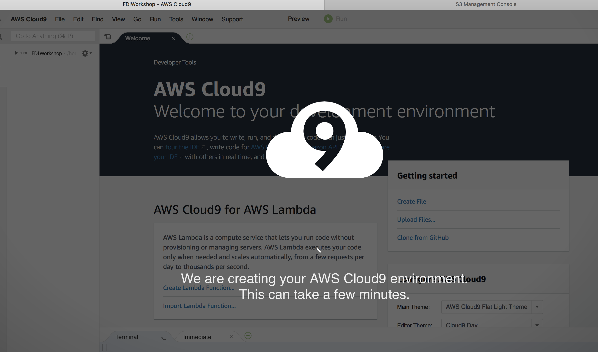
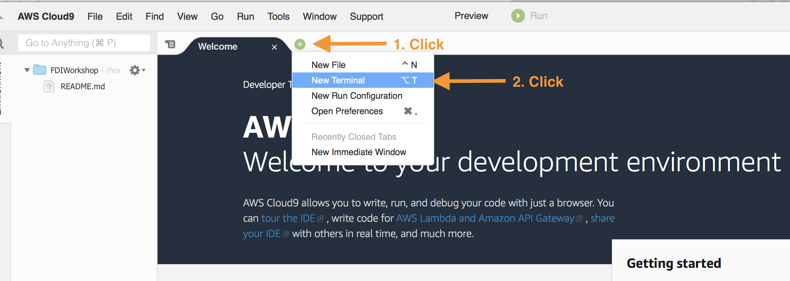

# Set up your development environment

**Time to complete:** 5-10 minutes.

## What are we building?

We are going to use [AWS Cloud9](https://aws.amazon.com/cloud9/) as our cloud-based integrated development environment. It will get you bootstrapped with the right tools and access for the workshop.

_If you already have a Cloud9 environment, feel free to use that._

### Step 1: Create a Cloud9 environment

<details>
<summary><strong>Expand if you want detailed directions</strong></summary><p>

Create your Cloud9 instance by following these steps:

1. Navigate to AWS Cloud9 [in the console](https://console.aws.amazon.com/cloud9)
1. Click **Create environment**
1. Provide a name: **FDIWorkshop**
1. Click **Next step**
1. Leave all defaults
1. Click **Next step**
1. Click **Create environment**

</p></details>

### Step 2: Wait for your environment to be all ready

Your AWS Cloud9 environment is being created and your screen will look like this:



After a minute or so, your environment will be ready and you can continue.

### Step 3: Validate your environment has credentials

1. Find the "Welcome" tab and click the plus icon next to it
1. Select **New Terminal**
1. Run a command to get the caller identity: `aws sts get-caller-identity`
    * *This command will let you know who you are (account number, user ID, ARN)*

*Hint: New editors and terminals can be created by clicking the green "+" icon in a circle*



### Step 4: Sync artifacts to S3 and copy down the scripts

Let's get our code and start working. Inside the terminal:

1. Run the following command to get the S3 bucket name (that has 'simplebucket' in the name):
    ```
    TeamRole:~/environment $ aws s3 ls | grep simplebucket
    2020-01-07 20:50:06 mod-7c974653c2164bca-simplebucket-1hao8m22eqq93
    ```
1. Sync artifacts to your bucket
    ```
    TeamRole:~/environment $ export artifacts=s3://ee-assets-prod-us-east-1/modules/7c974653c2164bcab350d902744088c5/v1
    TeamRole:~/environment $ export bucketname=`aws s3 ls | grep simplebucket | cut -d" " -f3`
    TeamRole:~/environment $ aws s3 sync $artifacts/data/ s3://$bucketname/data/
    TeamRole:~/environment $ aws s3 sync $artifacts/scripts/ s3://$bucketname/scripts/
    ```
1. Sync scripts to local
```
    TeamRole:~/environment $ mkdir -p scripts
    TeamRole:~/environment $ aws s3 sync $artifacts/scripts/ scripts
```

1. Verify contents in your S3 bucket, notice Bloomberg EOD price data (as compressed files) exists under _&lt;...-simplebucket-...&gt;/data/eod_px/_ folder

<details>
<summary><strong>Expand if you want detailed directions</strong></summary><p>

Check the data contents in S3 by following these steps:

1. Navigate to Amazon S3 [in the console](https://console.aws.amazon.com/s3)
1. Click on the **mod-...-simplebucket-...** bucket
1. Click on folder **data** then folder **eod_px**
1. You should notice several compressed files (\*.gz) files in there. These are Bloomberg North American Equities End of Day prices in Bloomberg's native format.

</p></details>

At this point we have built our cloud based development environment, verified it is configured with the right credentials, refreshed our S3 buckets and copied down the scripts.

## Next step:

We're ready to proceed with building the [data catalog in AWS Glue](../1_AWSGlueDataCatalog).
