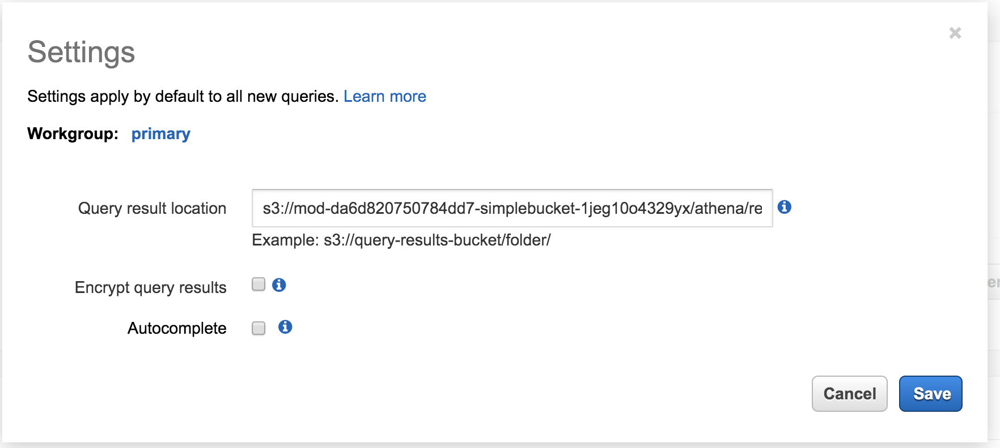
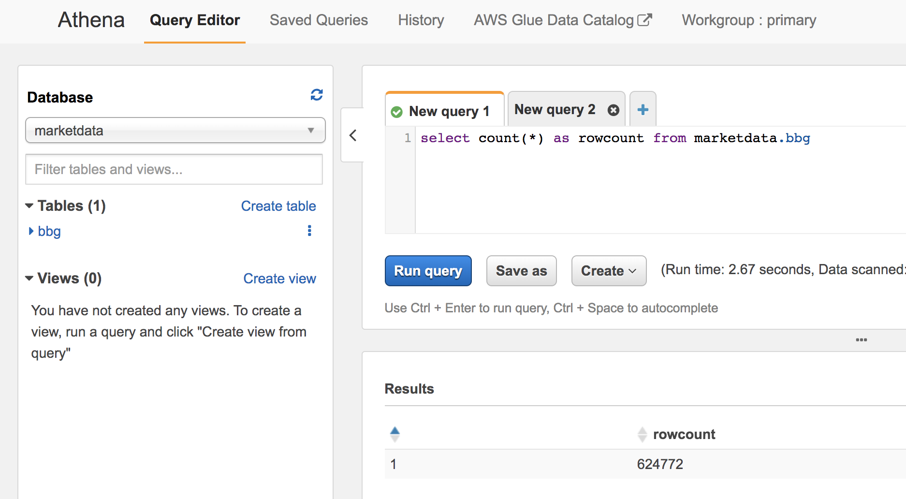
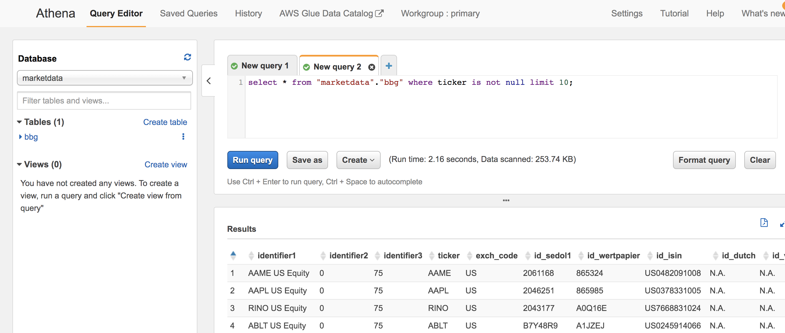

# Run SQL queries against raw data files using Amazon Athena

**Time to complete:** 10-15 minutes.

### Step 1: Initialize Amazon Athena settings

1. Navigate to Amazon Athena [in the console](https://console.aws.amazon.com/athena)

1. Setup your query result location to a folder within your S3 bucket
1. Click on **Settings**
1. Update S3 location to  s3://<your_bucket>/athena/results (E.g. s3://mod-da6d820750784dd7-simplebucket-1jeg10o4329yx/athena/results/

  

Note: You may have to create the _/athena/results_ folder in your S3 bucket to be able to save the settings

### Step 2: Run SQL Queries against raw files!

1. Click on **Query Editor**

1. In the **New Query** tabs you can run different queries

1. Run query to count the number of records
  ```
  select count(*) as rowcount from marketdata.bbg
  ```
  

1. Run query to inspect table content
  ```
  select * from "marketdata"."bbg" where ticker is not null limit 10;
  ```



## Next step:

We're ready to visualize raw data using [Amazon QuickSight](../3_AmazonQuickSight).
