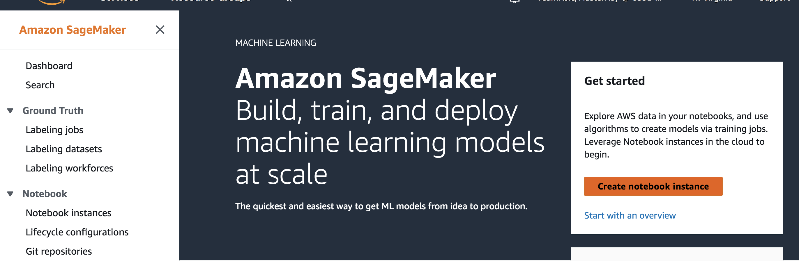
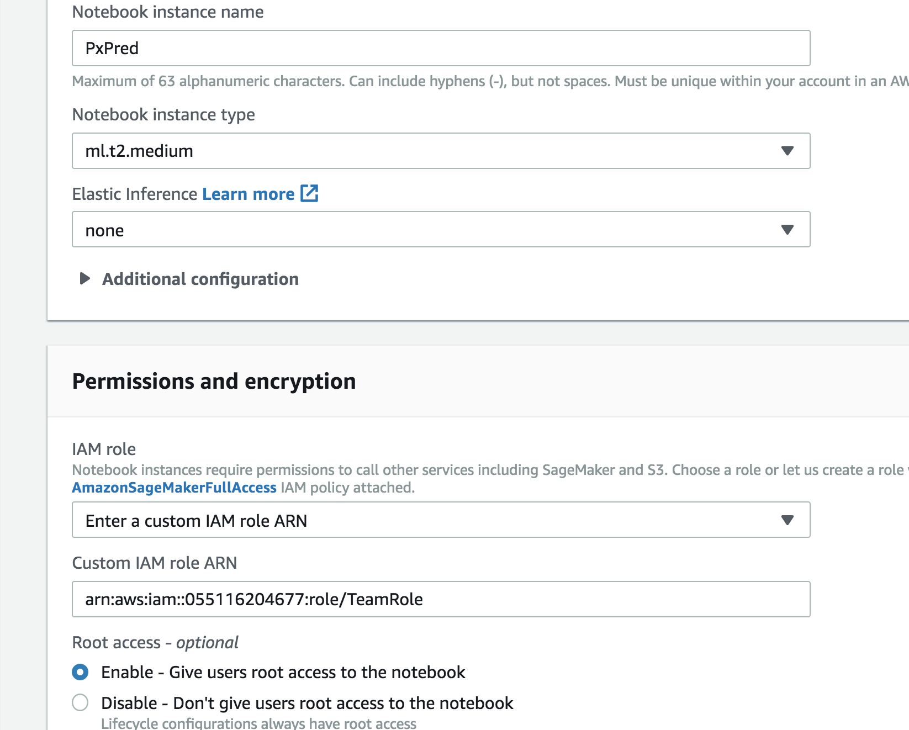
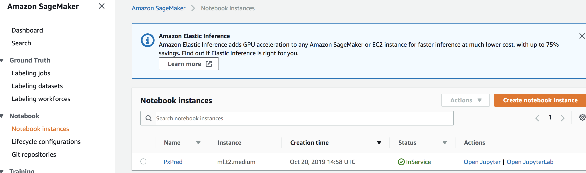
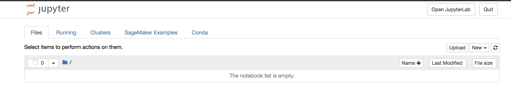
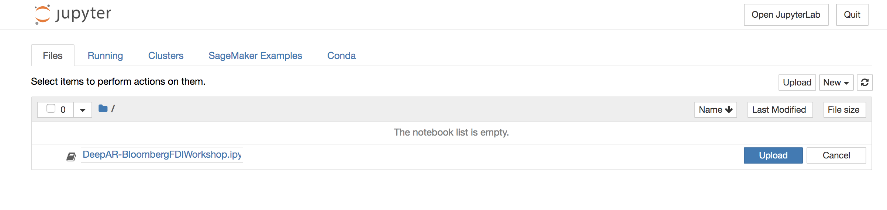
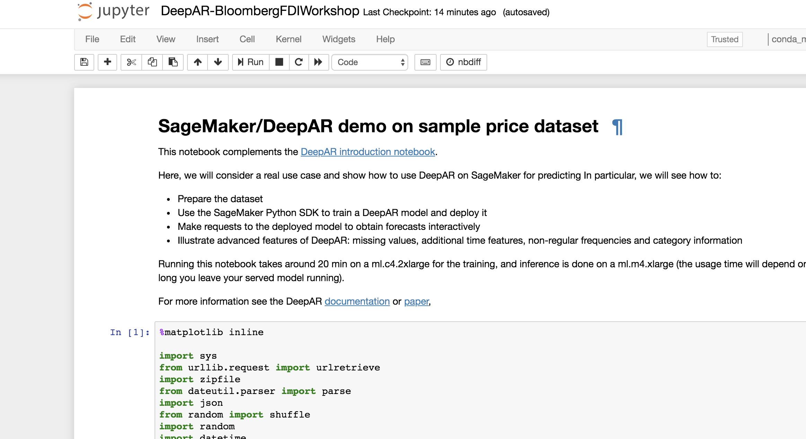
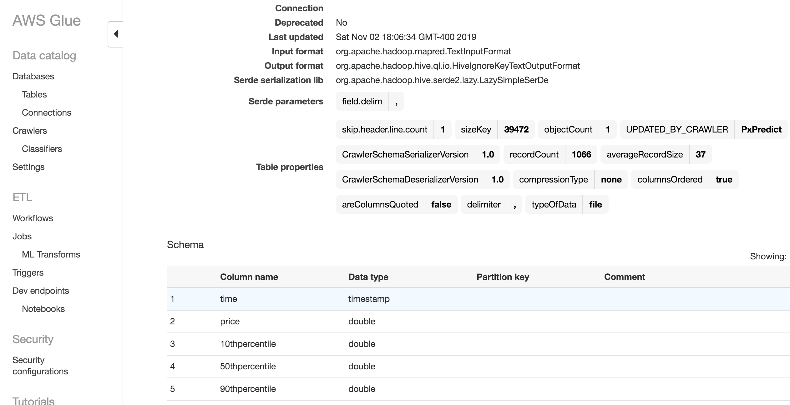

# Use Amazon SageMaker for Machine Learning capabilities

**Time to complete:** 15-30 minutes.

### Step 1: Setup the environment

1. Navigate to IAM [in the console](https://console.aws.amazon.com/iam) and click on **Roles** in the left panel, choose **TeamRole**, copy the **Role ARN** in the summary section, and save this information for later use

  

1. Navigate to Amazon Sagemaker [in the console](https://console.aws.amazon.com/sagemaker)

  

1. Click on **Create Notebook Instance**

1. Provide a Notebook Instance Name: **PxPred**

1. In the **Permissions and Encryption** section choose **Enter a custom IAM role ARN** and use the TeamRole ARN gotten from earlier step (E.g. “arn:aws:iam::055116204677:role/TeamRole”)

  

1. Scroll down and click on **Create notebook instance**

1. Wait for Jupyter notebook instance to be created

### Step 2: Creating the Jupyter notebook instance

1. When Jupyter notebook instance (PxPred) creation is complete, click on **Open Jupyter**

  

1. Download “DeepAR-BloombergFDIWorkshop.ipynb” from the S3 bucket under scripts.

  

1. Click on **Upload** to upload this file in the Jupyter notebook environment

  

1. Once uploaded, click on the file name to open the file in Jupyter notebook

  

### Step 3: Navigate through Jupyter notebook and execute the ML steps

1. In the code under the Jupyter notebook, update the **input_bucket** variable to the S3 bucket where the **tsla.csv** file exists.
    

    
<strong>Expand if you want detailed directions</strong>

    Check the data contents in S3 by following these steps:

    1. Navigate to Amazon S3 [in the console](https://console.aws.amazon.com/s3)
    1. Click on the **mod-...-simplebucket-...** bucket
    1. Copy the name
    

 2. Run through the Jupyter notebook steps - which includes visualizing the data, using DeepAR model, training the model, predicting and writing back the predicted results back on to S3.

### Step 4: AWS Glue and Amazon QuickSight visualization of Predicted results

1. After running **DeepAR** model, the script writes the predicted values to the same S3 bucket, but under a different folder (data/predicted).

1. Use AWS Glue crawler to generate the catalog.

1. In AWS Glue, edit the schema and update the “time” field to “timestamp” type (by default crawler assumes it as a “string”)

    

1. In Amazon QuickSight, create an Athena dataset and visualize using a line chart. Use the “time” field on X-axis, and plot Max(Price), Max(10thPercentile), Max(90thPercentile)

    

## Next step:

We're done with financial data, analytics, and machine learning portions of the workshop. Once done, you can [clean up the resources](../6_Cleanup) so that you're not charged.
