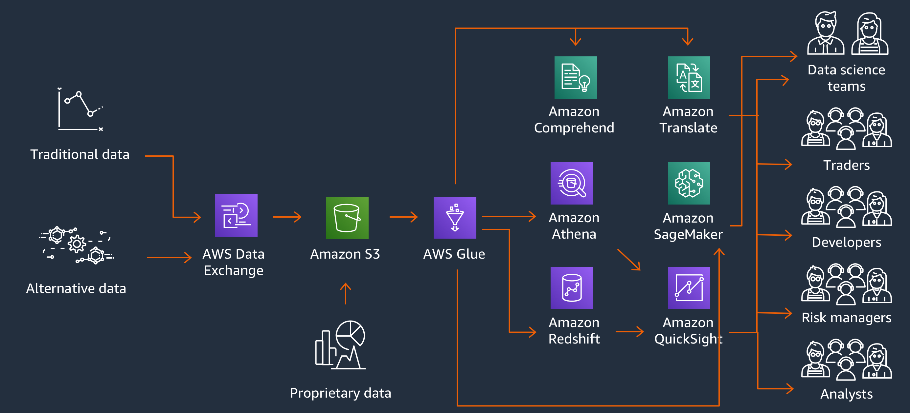

# Financial Data Innovation Workshop

As part of Financial Data Innovation workshop, participants will use familiar datasets, and AWS tools to speed up data ingestion, data analytics, and gain insights from the data.

_**add more contents._

_Time Commitment Expectations: This workshop was created to be completed in approximately 2 hours._

## Considerations for Each Role
As the team lead on this lean team of one, you'll need to wear multiple hats.  Below are some things we'll cover from the perspective of each role:
* Developer - You'll modify python script to create data catalog in AWS Glue.
* Data Scientist - You'll need to load the data into your machine learning development environment.  Once loaded, you'll understand the data, use a machine learning algorithm to train the model and do predictions.
* Trader - You will use different trading strategies based on data to maximize Profit & Loss while attributing to Risk.
* Analyst - You will use data visualization and AI tools to analyze Reports and gain insights from data.

## Goals

At minimum, at the end of this workshop, you should be successfully ingest data, use AWS Glue catalog, run adhoc queries against raw files using Amazon Athena, visualize data through AWS QuickSight. Load data onto Amazon Redshift for complex analytics and periodic reporting, and use Sagemaker to gain insights from the data.

## Solution Architecture

Customers can search for and subscribe data from AWS Data Exchange, or have the data delivered to their S3 bucket. AWS Glue can then maintain the data catalog. The raw data then becomes queryable through Amazon Athena. Amazon QuickSight can be used for Visualization. In order to complex analytics and periodic reporting, customers can use Amazon Redshift. The Redshift spectrum feature lets join data between the data warehouse and the data lake (S3). Amazon QuickSight also has Machine Learning insights built into it. More Machine learning can be done using Amazon Sagemaker. Customers across the organization can realize value from their data assets. Even without ML skills, personnel can use advanced AI tools such as Amazon Translate and Amazon Comprehend to translate and do sentiment analysis on data. Developers can also easily integrate these higher order services.

## Prerequisites

Provide a list of prerequisites that are required to successfully complete your workshop. This should include setting up an AWS account (note if you support multiple students sharing a single account), installing and configuring the CLI, and setting up any other tools students may need. Additionally, if there are specific skills or technologies students need to have existing knowledge of, you should list those here.

Add a subsection for each prerequisite.

Supported regions:
* us-east-1 (N. Virginia)
* us-east-2 (Ohio)
* us-west-2 (Oregon)
* ap-southeast-1 (Singapore)
* ap-northeast-1 (Tokyo)
* eu-central-1 (Frankfurt)
* eu-west-1 (Ireland)

## Modules

1. [Module 0: Setting up the environment](0_Setup)
1. [Module 1: Get market data and catalog data using AWS Glue](1_AWSGlueDataCatalog)
1. [Module 2: Run SQL Queries against raw data using Amazon Athhena](2_AmazonAthena)
1. [Module 3: Visualize data using Amazon QuickSight](3_AmazonQuickSight)
1. [Module 4: Complex Analytics and Reporting using Amazon Redshift](4_AmazonRedshift)
1. [Module 5: Machine Learning using Amazon Sagemaker](5_AmazonSagemaker)
1. [Module 6: Cleanup](6_AmazonRedshift)
